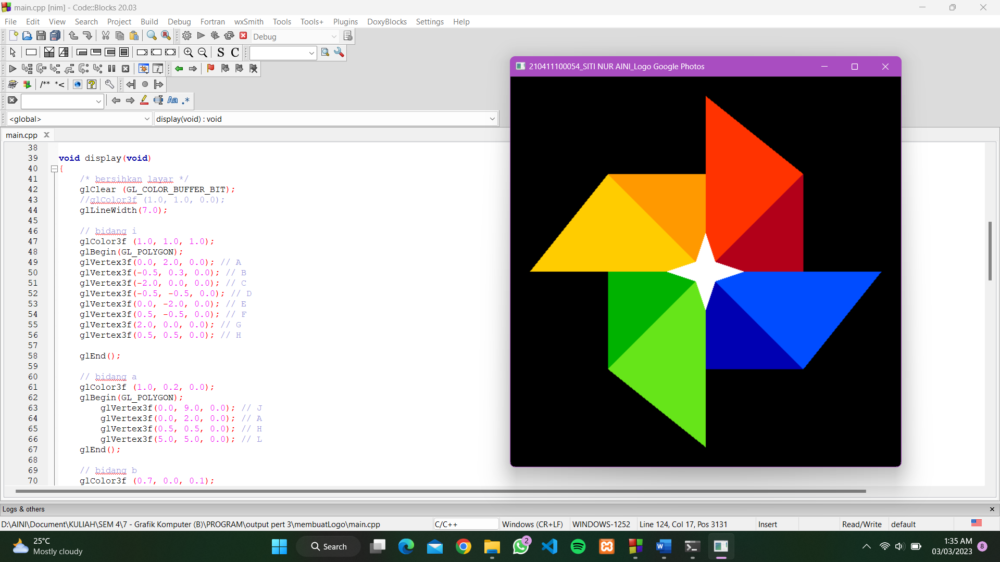
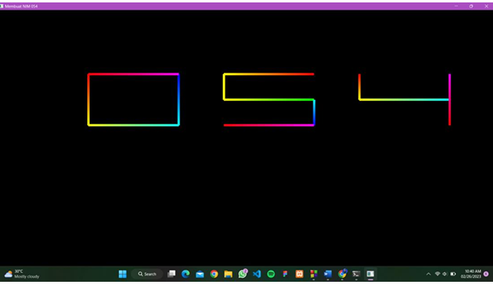
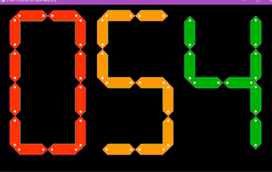

# 🎨 Proyek Grafika Komputer – OpenGL (GLUT)

---

## 📘 Deskripsi Umum
Repositori ini berisi kumpulan **tugas dan proyek mata kuliah Grafika Komputer** yang dikembangkan menggunakan **OpenGL (GLUT)** dengan bahasa pemrograman **C/C++**.

Semua program dijalankan dalam mode **2D (orthographic projection)** dan memanfaatkan konsep:
- Primitif OpenGL (`GL_POLYGON`, `GL_LINES`, dll)
- Transformasi 2D (`translate`, `rotate`, `scale`)
- Pewarnaan (solid dan gradasi)
- Interaksi keyboard (`glutKeyboardFunc`)

---

---

## 🧩 Folder: Tugas Harian

### 1️⃣ **Logo Google Photos**

Program ini menggambar **logo Google Photos** menggunakan **bentuk poligon berwarna**.  
Warna yang digunakan:
- 🔴 Merah  
- 🟡 Kuning  
- 🟢 Hijau  
- 🔵 Biru  

Menggunakan `GL_POLYGON` dan sistem koordinat 2D.

**Tujuan:** memahami koordinat, warna, dan pembentukan bentuk dasar OpenGL.

---

### 2️⃣ **NIM Akhir (054) – Versi Garis**

Membentuk angka **0**, **5**, dan **4** menggunakan **garis (`GL_LINES`)**.  
Setiap sisi garis memiliki **warna pelangi (gradasi RGB)**.  
Hasil akhir berupa susunan angka warna-warni di layar hitam.

**Tujuan:** latihan membuat bentuk dengan garis serta mengatur warna vertex berbeda.

---

## 🧠 Folder: Proyek

### 🧮 **UTS – Visualisasi NIM “054” dengan Transformasi**

Program ini menggambar angka **“054”** menggunakan **kotak dan lingkaran kecil** yang disusun dengan **transformasi (translate, rotate, scale)**.  
Setiap angka memiliki warna berbeda:
- 0 → 🟠 Oranye  
- 5 → 🟡 Oranye kekuningan  
- 4 → 🟢 Hijau  

Objek didekorasi dengan **garis tepi gradasi** (putih, biru, pink, toska) untuk mempercantik tampilan.

**Tujuan:** memahami transformasi lokal dan global di OpenGL serta penerapan fungsi `glPushMatrix()` dan `glPopMatrix()`.

---

### 🎨 **UAS – Visualisasi 4 Objek 2D Interaktif**

Proyek akhir menampilkan **empat objek 2D**:
1. 🧺 **Mesin Cuci**  
2. 💎 **Diamond**  
3. 🐧 **Pinguin**  
4. 🌸 **Bunga**

Setiap objek dapat **digerakkan secara independen** menggunakan kombinasi tombol:
| Objek | Tombol | Fungsi |
|--------|---------|--------|
| Mesin Cuci | `W`, `A`, `S`, `D` | Geser atas, kiri, bawah, kanan |
| Diamond | `T`, `F`, `G`, `H` | Geser atas, kiri, bawah, kanan |
| Pinguin | `I`, `J`, `K`, `L` | Geser atas, kiri, bawah, kanan |
| Bunga | `2`, `4`, `5`, `6` | Geser atas, kiri, bawah, kanan |

**Transformasi Global:**
- `R` → Rotasi ke kanan  
- `E` → Rotasi ke kiri  
- `X` → Perbesar  
- `Z` → Perkecil  
- `Q` atau `ESC` → Keluar program  

**Tujuan:** menggabungkan berbagai transformasi dan interaksi real-time dalam satu aplikasi.

---

## 💻 Teknologi yang Digunakan
| Komponen | Keterangan |
|-----------|-------------|
| Bahasa Pemrograman | C / C++ |
| Library | OpenGL, GLUT |
| Mode Tampilan | 2D Ortho Projection (`gluOrtho2D`) |
| IDE | Code::Blocks / Visual Studio / Dev-C++ |

---

